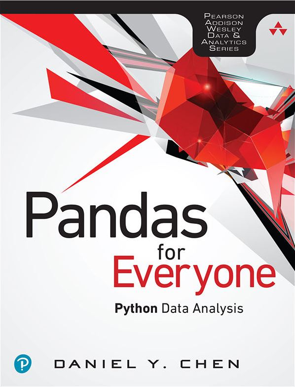

# Pandas-syntax

Pandas library using Jupyter notebooks

Pandas for everyone. Python Data Analysis by Daniel Y. Chen

Original copy of this book can be purchased from Pearson(https://www.pearson.com/) and has all the explanations and steps required.

This repo is a tutorial of some examples from the book. They are worked on Python using Pandas, Seaborn, Statsmodels and Scikit Learn.

The book contains 16 chapters. In this repo, Chapter 1, 2, 3, 4, 5, 6, 12, 13, 14, 15 and 16 were worked.

Each folder in the repo contains:
 - Examples (Jupyter notebook)
